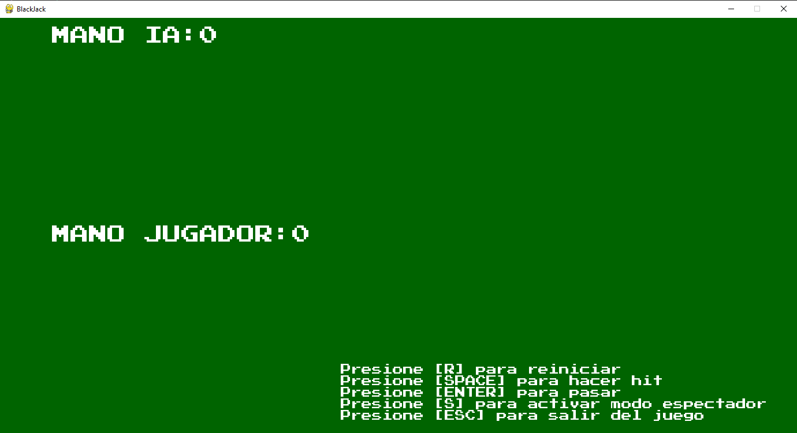
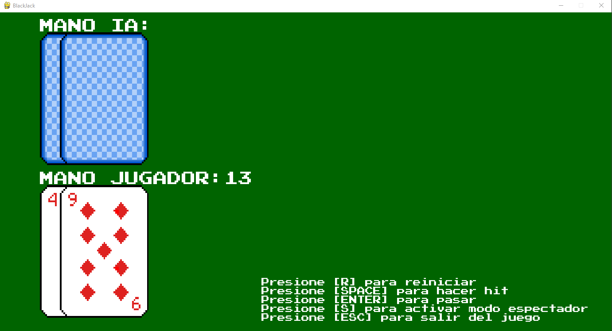
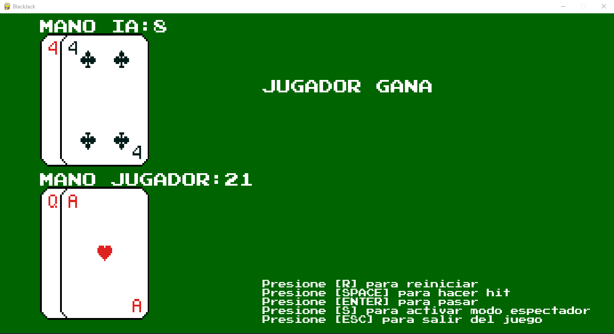
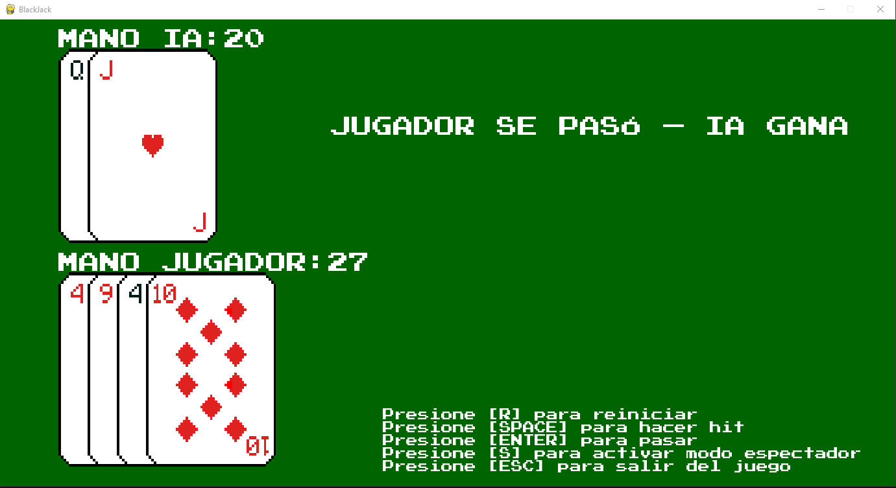
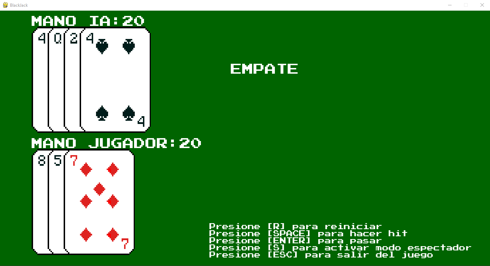

# Juego de BlackJack

¡Bienvenido al juego de BlackJack! Este proyecto es una implementación simple del clásico juego de cartas utilizando Python y Pygame. El juego te permite jugar contra un dealer de IA e incluye una interfaz gráfica para mejorar la experiencia de juego.

## Características
- Juega contra un dealer de IA.
- Interfaz gráfica interactiva con visualización de cartas.
- Actualizaciones y puntuaciones en tiempo real.
- Instrucciones del juego mostradas en pantalla.
- Modos de reinicio y espectador, el modo espectador te permite ver las cartas del dealer en todo momento.

## Requisitos

Para ejecutar este proyecto, necesitarás:
- Python 3.x
- Biblioteca Pygame

Puedes instalar Pygame usando pip:

```bash
pip install pygame
```
# Controles
- [ESPACIO]: Robar una carta (Hit)
- [ENTER]: Pasar turno
- [R]: Reiniciar el juego
- [S]: Alternar el modo espectador (ver la mano de la IA)
- [ESC]: Salir del juego

# Lógica del Juego
- Cada jugador (tú y la IA) comienza con dos cartas.
- El objetivo es acercarse lo más posible a 21 sin pasarse.
- El jugador puede elegir robar (hit) o pasar.
- La IA robará cartas según el valor de su mano.
- El As puede valer 1 o 11.
- El juego mostrará al ganador al final de cada ronda.

# Estados del juego
***Inicial***


***Hit***


***Gana/Win***


***Pierde/Lose***


***Empate***

